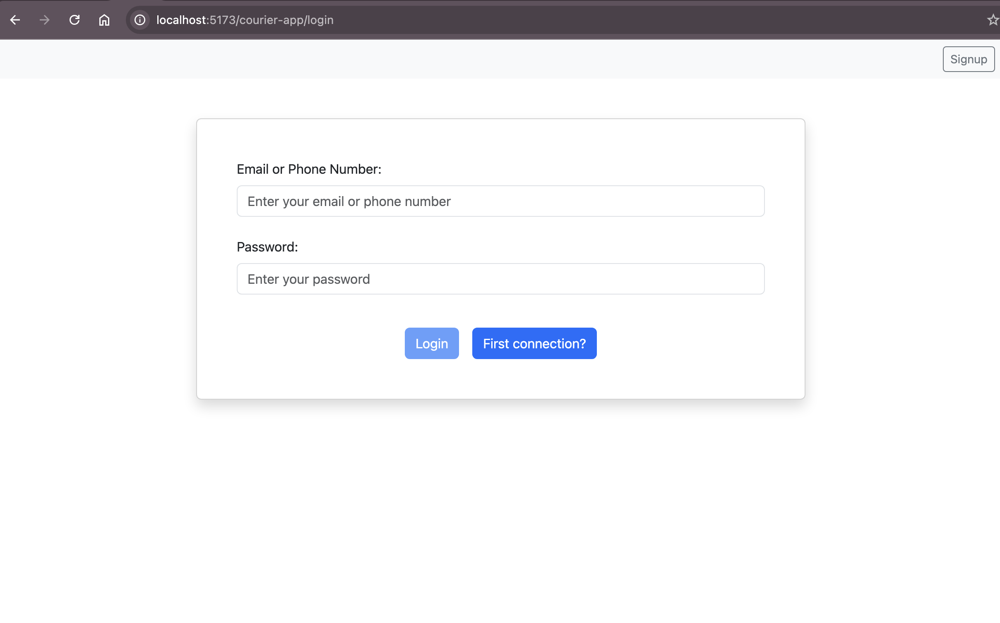
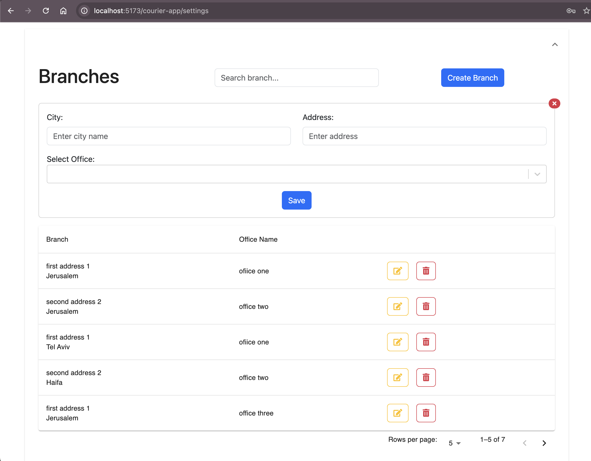
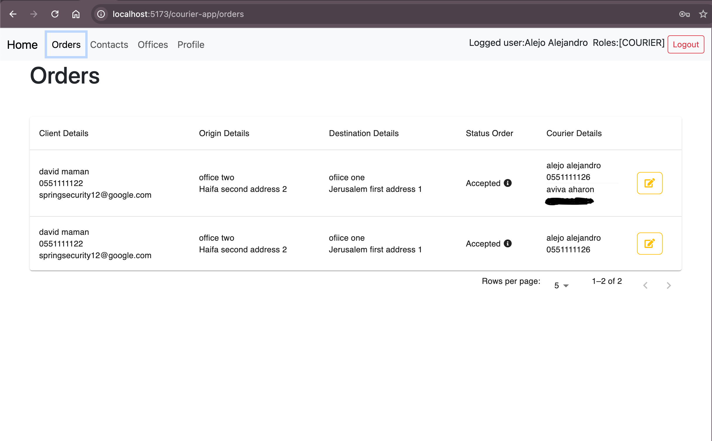
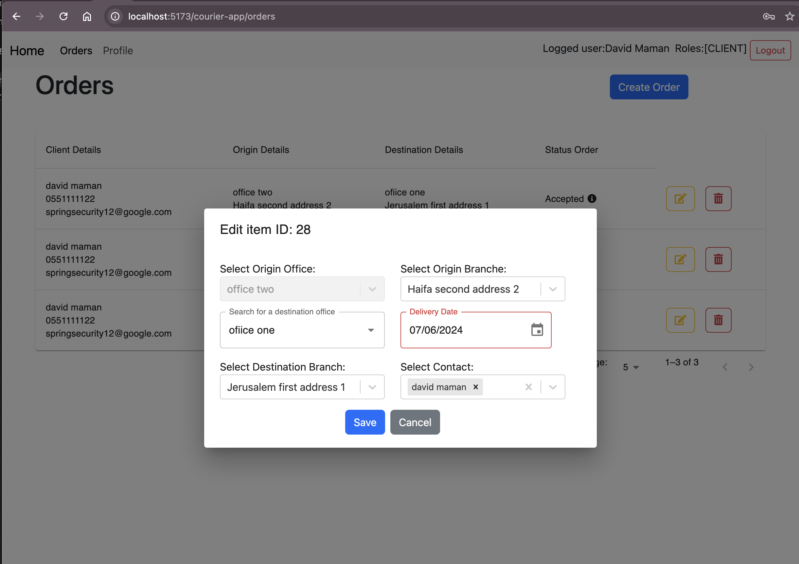

# Courier Fullstack Project

This project includes a backend developed with Spring Boot Cloud, Eureka, API Gateway, and Kafka, and a frontend developed with React, Redux Toolkit, and TypeScript. It includes features for user authentication, order management, and real-time updates using Kafka. The frontend also utilizes `use-debounce` for optimized performance.

## Getting Started

### Prerequisites
- Java 17 (Install using Homebrew: `brew install openjdk@17`)
- Node.js and npm
- Docker and Docker Compose

### Installation

1. **Clone the repository**
    ```bash
    git clone https://github.com/dmaman86/courier-app.git
    cd courier-app
    ```

2. **Configure the enviroment**
    - Make sure you have Java 17 installed.
    - Update the database connection details in `./src/main/resources/application.yml` for `authentication-server`, `courier-server`, `primes-server` and `error-server`:
        ```yaml
        spring:
        datasource:
            username: your_db_username
            password: your_db_password
        ```

3. **Start necessary services**
    - Use Docker to start Kafka services, navigate to directory `courier-backend` and run:
        ```bash
        docker-compose up --build -d
        ```

4. **Build and run the backend servers**
    - Navigate to each server directory (`service-registry`, `spring-cloud-gateway`, `primes-server`, `authentication-server`, `courier-server`, `error-server`) and run:
        ```bash
        mvn spring-boot:run
        ```

5. **Set up and run the frontend**
    - Navigate to the frontend directory (e.g., `courier-frontend`) and run:
        ```bash
        npm install
        npm run dev
        ```

6. **Access the application**
    - The backend application will be available at `http://localhost:8080`.
    - The frontend will be availabe at `http://localhost:5173`.

## Note
- The full Dockerization of the project is not yet completed, except for the use of Kafka. Please follow the instructions above to run the project locally.

## Contributing

Contributions are welcome! Please create a pull request or open an issue to discuss what you would like to change.

## License

This project is licensed under the MIT License - see the [LICENSE.md](LICENSE.md) file for details.


## Frontend Functionality

|  |  |
|:---:|:---:|
| *Login Page* | *Signup Page* |

### Admin Functionality
Admins have access to a wide range of features including user management, office and branch management, and order oversight.


*Admin Dashboard*

|  |  |
|:---:|:---:|
| *Admin Manage Users* | *Admin Create User* |

|  |  |
|:---:|:---:|
| *Admin Manage Branches* | *Admin Manage Orders* |

### Courier Functionality

Couriers can view and manage their assigned deliveries, update delivery statuses, and view order details.


*Courier Dashboard*

|  |  |
|:---:|:---:|
| *Courier Manage Order* | *Courier Update Status Order* |

### Client Functionality

Clients can place orders, track the status of their deliveries, and update their profile information.


*Client Dashboard*

|  |  |
|:---:|:---:|
| *Client Create Order* | *Client Update Order* |

## Backend Structure:

```bash
.
├── authentication-server
│   ├── Dockerfile
│   ├── mvnw
│   ├── mvnw.cmd
│   ├── pom.xml
│   └── src
│       ├── main
│       │   ├── java
│       │   │   └── com
│       │   │       └── david
│       │   │           └── maman
│       │   │               └── authenticationserver
│       │   │                   ├── AuthenticationServerApplication.java
│       │   │                   ├── configuration
│       │   │                   │   ├── ExceptionHandlerFilter.java
│       │   │                   │   ├── JwtAuthenticationFilter.java
│       │   │                   │   └── security
│       │   │                   │       ├── ApplicationConfig.java
│       │   │                   │       ├── KafkaProducerConfig.java
│       │   │                   │       └── SecurityConfiguration.java
│       │   │                   ├── controllers
│       │   │                   │   └── AuthController.java
│       │   │                   ├── exceptions
│       │   │                   │   ├── GlobalExceptionsHandler.java
│       │   │                   │   └── TokenValidationException.java
│       │   │                   ├── helpers
│       │   │                   │   ├── CustomUserDetails.java
│       │   │                   │   ├── TokenType.java
│       │   │                   │   └── UserDetailsServiceImpl.java
│       │   │                   ├── models
│       │   │                   │   ├── dto
│       │   │                   │   │   ├── AuthResponse.java
│       │   │                   │   │   ├── ErrorLogDto.java
│       │   │                   │   │   ├── LoginDto.java
│       │   │                   │   │   ├── PrimeProductDto.java
│       │   │                   │   │   ├── RSAKeyManager.java
│       │   │                   │   │   └── UserCredentialsPassword.java
│       │   │                   │   └── entities
│       │   │                   │       ├── Role.java
│       │   │                   │       ├── Token.java
│       │   │                   │       ├── User.java
│       │   │                   │       └── UserCredentials.java
│       │   │                   ├── repositories
│       │   │                   │   ├── RoleRepository.java
│       │   │                   │   ├── TokenRepository.java
│       │   │                   │   ├── UserCredentialsRepository.java
│       │   │                   │   └── UserRepository.java
│       │   │                   └── services
│       │   │                       ├── AuthService.java
│       │   │                       ├── ConsumerListenerService.java
│       │   │                       ├── ErrorLogService.java
│       │   │                       ├── HealthCheckService.java
│       │   │                       ├── JwtKeyService.java
│       │   │                       ├── JwtService.java
│       │   │                       ├── RoleService.java
│       │   │                       ├── UserCredentialsService.java
│       │   │                       └── impl
│       │   │                           ├── AuthServiceImpl.java
│       │   │                           └── JwtServiceImpl.java
│       │   └── resources
│       │       └── application.yml
│       └── test
│           └── java
│               └── com
│                   └── david
│                       └── maman
│                           └── authenticationserver
│                               └── AuthenticationServerApplicationTests.java
├── courier-server
│   ├── Dockerfile
│   ├── mvnw
│   ├── mvnw.cmd
│   ├── pom.xml
│   └── src
│       ├── main
│       │   ├── java
│       │   │   └── com
│       │   │       └── david
│       │   │           └── maman
│       │   │               └── courierserver
│       │   │                   ├── CourierServerApplication.java
│       │   │                   ├── configuration
│       │   │                   │   ├── AuthFilter.java
│       │   │                   │   ├── ExceptionHandlerFilter.java
│       │   │                   │   └── security
│       │   │                   │       ├── KafkaProviderConfig.java
│       │   │                   │       └── SecurityConfig.java
│       │   │                   ├── controllers
│       │   │                   │   ├── BranchController.java
│       │   │                   │   ├── ContactController.java
│       │   │                   │   ├── OfficeController.java
│       │   │                   │   ├── OrderController.java
│       │   │                   │   ├── OrderStatusHistoryController.java
│       │   │                   │   ├── RoleController.java
│       │   │                   │   ├── StatusController.java
│       │   │                   │   └── UserController.java
│       │   │                   ├── exceptions
│       │   │                   │   ├── GlobalExceptionsHandler.java
│       │   │                   │   ├── PublicKeyNotAvailableException.java
│       │   │                   │   └── TokenValidationException.java
│       │   │                   ├── helpers
│       │   │                   │   ├── CustomUserDetails.java
│       │   │                   │   ├── IdExtractor.java
│       │   │                   │   ├── SearchByDate.java
│       │   │                   │   ├── SearchByDateRange.java
│       │   │                   │   ├── SearchFunction.java
│       │   │                   │   └── StatusEnum.java
│       │   │                   ├── mappers
│       │   │                   │   ├── BranchMapper.java
│       │   │                   │   ├── ContactMapper.java
│       │   │                   │   ├── OfficeMapper.java
│       │   │                   │   ├── OrderMapper.java
│       │   │                   │   ├── OrderStatusHistoryMapper.java
│       │   │                   │   ├── RoleMapper.java
│       │   │                   │   ├── StatusMapper.java
│       │   │                   │   └── UserMapper.java
│       │   │                   ├── models
│       │   │                   │   ├── criteria
│       │   │                   │   │   ├── BranchSpecification.java
│       │   │                   │   │   ├── ContactSpecification.java
│       │   │                   │   │   ├── OfficeSpecification.java
│       │   │                   │   │   ├── SearchCriteria.java
│       │   │                   │   │   └── UserSepecification.java
│       │   │                   │   ├── dto
│       │   │                   │   │   ├── AdminDto.java
│       │   │                   │   │   ├── BranchDto.java
│       │   │                   │   │   ├── ClientDto.java
│       │   │                   │   │   ├── ContactDto.java
│       │   │                   │   │   ├── CourierDto.java
│       │   │                   │   │   ├── ErrorLogDto.java
│       │   │                   │   │   ├── OfficeDto.java
│       │   │                   │   │   ├── OrderDto.java
│       │   │                   │   │   ├── OrderStatusDto.java
│       │   │                   │   │   ├── RoleDto.java
│       │   │                   │   │   ├── StatusDto.java
│       │   │                   │   │   ├── UserDto.java
│       │   │                   │   │   └── base
│       │   │                   │   │       ├── BranchInfoDto.java
│       │   │                   │   │       └── OfficeInfoDto.java
│       │   │                   │   └── entities
│       │   │                   │       ├── Branch.java
│       │   │                   │       ├── Contact.java
│       │   │                   │       ├── Office.java
│       │   │                   │       ├── Order.java
│       │   │                   │       ├── OrderStatusHistory.java
│       │   │                   │       ├── Role.java
│       │   │                   │       ├── Status.java
│       │   │                   │       └── User.java
│       │   │                   ├── repositories
│       │   │                   │   ├── BranchRepository.java
│       │   │                   │   ├── ContactRepository.java
│       │   │                   │   ├── OfficeRepository.java
│       │   │                   │   ├── OrderRepository.java
│       │   │                   │   ├── OrderStatusHistoryRepository.java
│       │   │                   │   ├── RoleRepository.java
│       │   │                   │   ├── StatusRepository.java
│       │   │                   │   └── UserRepository.java
│       │   │                   └── services
│       │   │                       ├── BranchService.java
│       │   │                       ├── ContactService.java
│       │   │                       ├── ErrorLogService.java
│       │   │                       ├── JwtService.java
│       │   │                       ├── JwtValidationService.java
│       │   │                       ├── KafkaProducerService.java
│       │   │                       ├── OfficeService.java
│       │   │                       ├── OrderService.java
│       │   │                       ├── OrderStatusHistoryService.java
│       │   │                       ├── RoleService.java
│       │   │                       ├── StatusService.java
│       │   │                       ├── UserService.java
│       │   │                       └── impl
│       │   │                           ├── BranchServiceImpl.java
│       │   │                           ├── ContactServiceImpl.java
│       │   │                           ├── JwtServiceImpl.java
│       │   │                           ├── OfficeServiceImpl.java
│       │   │                           ├── OrderServiceImpl.java
│       │   │                           ├── OrderStatusHistoryServiceImpl.java
│       │   │                           ├── RoleServiceImpl.java
│       │   │                           ├── StatusServiceImpl.java
│       │   │                           └── UserServiceImpl.java
│       │   └── resources
│       │       └── application.yml
│       └── test
│           └── java
│               └── com
│                   └── david
│                       └── maman
│                           └── courierserver
│                               └── CourierServerApplicationTests.java
├── docker-compose.yml
├── error-server
│   ├── Dockerfile
│   ├── HELP.md
│   ├── mvnw
│   ├── mvnw.cmd
│   ├── pom.xml
│   └── src
│       ├── main
│       │   ├── java
│       │   │   └── com
│       │   │       └── david
│       │   │           └── maman
│       │   │               └── errorserver
│       │   │                   ├── ErrorServerApplication.java
│       │   │                   ├── models
│       │   │                   │   ├── dto
│       │   │                   │   │   └── ErrorLogDto.java
│       │   │                   │   └── entity
│       │   │                   │       └── ErrorLog.java
│       │   │                   ├── repositories
│       │   │                   │   └── ErrorLogRepository.java
│       │   │                   └── services
│       │   │                       └── KafkaErrorLogListener.java
│       │   └── resources
│       │       └── application.yml
│       └── test
│           └── java
│               └── com
│                   └── david
│                       └── maman
│                           └── errorserver
│                               └── ErrorServerApplicationTests.java
├── primes-server
│   ├── Dockerfile
│   ├── HELP.md
│   ├── mvnw
│   ├── mvnw.cmd
│   ├── pom.xml
│   └── src
│       ├── main
│       │   ├── java
│       │   │   └── com
│       │   │       └── david
│       │   │           └── maman
│       │   │               └── primesserver
│       │   │                   ├── PrimesServerApplication.java
│       │   │                   ├── configurations
│       │   │                   │   └── KafkaProviderConfig.java
│       │   │                   ├── listeners
│       │   │                   │   └── PrimeProductListener.java
│       │   │                   ├── models
│       │   │                   │   ├── dto
│       │   │                   │   │   └── PrimeProductDto.java
│       │   │                   │   └── entities
│       │   │                   │       └── PrimeProduct.java
│       │   │                   ├── repositories
│       │   │                   │   └── PrimeProductRepository.java
│       │   │                   └── services
│       │   │                       └── PrimeProductService.java
│       │   └── resources
│       │       └── application.yml
│       └── test
│           └── java
│               └── com
│                   └── david
│                       └── maman
│                           └── primesserver
│                               └── PrimesServerApplicationTests.java
├── service-registry
│   ├── Dockerfile
│   ├── mvnw
│   ├── mvnw.cmd
│   ├── pom.xml
│   └── src
│       ├── main
│       │   ├── java
│       │   │   └── com
│       │   │       └── david
│       │   │           └── maman
│       │   │               └── serviceregistry
│       │   │                   └── ServiceRegistryApplication.java
│       │   └── resources
│       │       └── application.yml
│       └── test
│           └── java
│               └── com
│                   └── david
│                       └── maman
│                           └── serviceregistry
│                               └── ServiceRegistryApplicationTests.java
└── spring-cloud-gateway
    ├── Dockerfile
    ├── mvnw
    ├── mvnw.cmd
    ├── pom.xml
    └── src
        ├── main
        │   ├── java
        │   │   └── com
        │   │       └── david
        │   │           └── maman
        │   │               └── springcloudgateway
        │   │                   ├── SpringCloudGatewayApplication.java
        │   │                   └── config
        │   │                       ├── GatewayConfig.java
        │   │                       └── RouterValidator.java
        │   └── resources
        │       └── application.yml
        └── test
            └── java
                └── com
                    └── david
                        └── maman
                            └── springcloudgateway
                                └── SpringCloudGatewayApplicationTests.java

```

## Additional Backend Information:

### Primes-Server
- Generates two distinct prime numbers using the Rabin-Miller algorithm.
- Sends the product of the prime numbers and the phi of this number to the Authentication-Server via Kafka.

### Authentication-Server
- Rejects all requests until it receives the values from Primes-Server.
- Upon receiving the values, it generates private and public keys.
- Uses the private key to sign tokens and the public key to validate the signature.
- Sends the public key to Courier-Server.

### Courier-Server
- Rejects all requests until it receives the public key from the Authentication-Server.

### Error-Server
- Logs errors from the Authentication-Server and Courier-Server.
- Receives errors via Kafka from these servers.

## Frontend Structure:

```bash
.
├── README.md
├── index.html
├── package-lock.json
├── package.json
├── public
│   └── vite.svg
├── src
│   ├── App.css
│   ├── App.tsx
│   ├── assets
│   │   └── react.svg
│   ├── domain
│   │   ├── axios.models.ts
│   │   ├── form.models.ts
│   │   ├── index.ts
│   │   ├── models.ts
│   │   ├── props.models.ts
│   │   └── reducer.models.ts
│   ├── helpers
│   │   ├── index.ts
│   │   ├── load-abort-axios.ts
│   │   ├── paths.ts
│   │   └── validation.form.ts
│   ├── hoc
│   │   ├── index.ts
│   │   └── withLoading.tsx
│   ├── hooks
│   │   ├── index.ts
│   │   ├── useAsync.ts
│   │   ├── useAuth.ts
│   │   ├── useFetchAndLoad.ts
│   │   ├── useForm.ts
│   │   ├── useItemsPageState
│   │   │   ├── reducer.ts
│   │   │   └── useItemsPage.ts
│   │   ├── useList.ts
│   │   └── useNavbar
│   │       ├── reducer.ts
│   │       └── useNavbar.ts
│   ├── index.css
│   ├── main.tsx
│   ├── redux
│   │   ├── states
│   │   │   └── authSlice.ts
│   │   └── store.ts
│   ├── routes
│   │   ├── PrivateRoutes.tsx
│   │   ├── PublicRoutes.tsx
│   │   ├── index.ts
│   │   └── routes.tsx
│   ├── services
│   │   ├── api.ts
│   │   ├── cache.ts
│   │   ├── index.ts
│   │   ├── service-request.ts
│   │   └── token.service.ts
│   ├── ui
│   │   ├── components
│   │   │   ├── dialogs
│   │   │   │   ├── CustomDialog.tsx
│   │   │   │   ├── GenericModal.tsx
│   │   │   │   └── index.ts
│   │   │   ├── entityForm
│   │   │   │   ├── BranchForm.tsx
│   │   │   │   ├── ContactForm.tsx
│   │   │   │   ├── OfficeForm.tsx
│   │   │   │   ├── OrderForm.tsx
│   │   │   │   ├── RoleForm.tsx
│   │   │   │   ├── StatusOrderForm.tsx
│   │   │   │   ├── UpdatePassword.tsx
│   │   │   │   ├── UserForm.tsx
│   │   │   │   └── index.ts
│   │   │   ├── form
│   │   │   │   ├── ReusableInput.tsx
│   │   │   │   ├── ReusableSelect.tsx
│   │   │   │   ├── SelectDetailsForm.tsx
│   │   │   │   └── index.ts
│   │   │   ├── index.ts
│   │   │   ├── layout
│   │   │   │   ├── BranchesPartial.tsx
│   │   │   │   ├── ErrorFallback.tsx
│   │   │   │   ├── Navbar.tsx
│   │   │   │   ├── NavbarLinks.tsx
│   │   │   │   ├── PageHeader.tsx
│   │   │   │   ├── PasswordRulesList.tsx
│   │   │   │   ├── RolePartial.tsx
│   │   │   │   ├── StatusOrdersPartial.tsx
│   │   │   │   ├── UserDetails.tsx
│   │   │   │   └── index.ts
│   │   │   └── tables
│   │   │       ├── ReusableTable.tsx
│   │   │       ├── index.ts
│   │   │       └── list
│   │   │           ├── BranchList.tsx
│   │   │           ├── ContactList.tsx
│   │   │           ├── OfficeList.tsx
│   │   │           ├── OrderList.tsx
│   │   │           ├── RoleList.tsx
│   │   │           ├── StatusOrdersList.tsx
│   │   │           ├── UserList.tsx
│   │   │           └── index.ts
│   │   ├── index.ts
│   │   └── pages
│   │       ├── ContactsPage.tsx
│   │       ├── Home
│   │       │   ├── Home.tsx
│   │       │   ├── HomeAdmin.tsx
│   │       │   ├── HomeClient.tsx
│   │       │   ├── HomeCourier.tsx
│   │       │   └── index.ts
│   │       ├── ItemsPage.tsx
│   │       ├── Login.tsx
│   │       ├── OfficesPage.tsx
│   │       ├── OrdersPage.tsx
│   │       ├── Profile.tsx
│   │       ├── SettingsAdmin.tsx
│   │       ├── SignUp.tsx
│   │       ├── UsersPage.tsx
│   │       └── index.ts
│   ├── useCases
│   │   ├── form
│   │   │   ├── index.ts
│   │   │   └── useAuthForm.ts
│   │   ├── index.ts
│   │   ├── useRouteConfig.ts
│   │   └── useUserItemActions.ts
│   └── vite-env.d.ts
├── tsconfig.json
├── tsconfig.node.json
└── vite.config.ts
```
## Additional Frontend Information:

### Components
- **Common:** Contains reusable components like `Navbar`, `Profile`, `ContactsPage`, etc., which are used throughout the application.
- **ListTables:** Components for displaying lists of entities such as branches, contacts, offices, orders, roles, status orders, and users.
- **Modals:** Components for creating or editing entities. Examples include `BranchForm`, `ContactForm`, `OrderForm`, etc.
- **Pages:** Different page components for various routes like `Home`, `Login`, `SignUp`, and role-specific pages like `HomeAdmin`, `HomeClient`, and `HomeCourier`.
- **Partials:** Partial components used in other components or pages, such as `BranchesPartial`, `PasswordRulesList`, etc.
- **Shared:** Shared components like `AlertDialog`, `ItemsPage`, `ReusableInput`, `ReusableSelect`, and `ReusableTable` that provide common functionalities across the application.

### Helpers and Hooks
- Custom hooks like `useAsync`, `useAuth`, `useFetchAndLoad`, `useForm`, `useList`, and `useRouteConfig` to manage data fetching, authentication, form handling, and other functionalities.
- Helper functions for various utilities and configurations like `load-abort-axios`, `paths`, and `validation.form`.

### Redux
- **State Management:** The `authSlice` and `store.ts` files configure Redux for global state management, handling authentication and other states.

### Routes
- **Routing Configuration:** `PrivateRoutes` and `PublicRoutes` handle the routing logic for authenticated and unauthenticated users, respectively. The `routes.tsx` file defines the application's routes.

### Services
- **API Interaction:** Services like `api.ts`, `service-request.ts`, and `token.service.ts` manage interactions with the backend APIs, including token management and caching.

### Types
- **Type Definitions:** TypeScript models for Axios requests (`axios.models.ts`), form data (`form.models.ts`), general models (`models.ts`), and component props (`props.models.ts`) to ensure type safety across the application.


