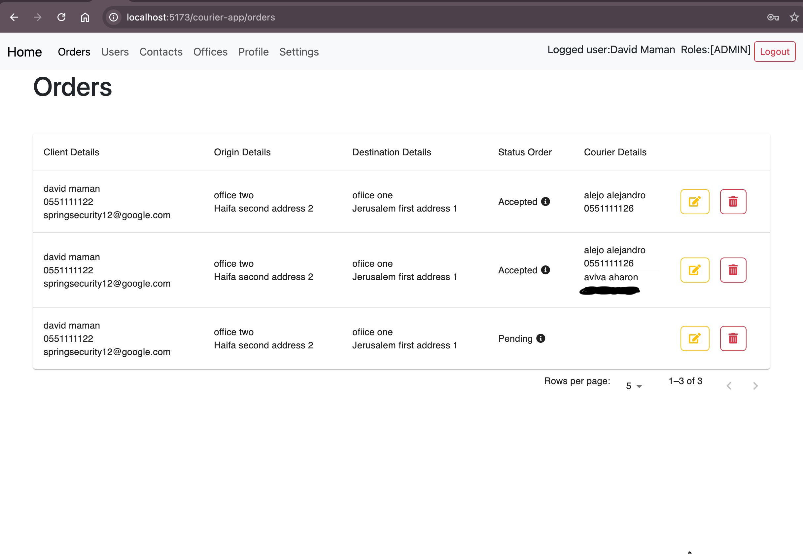
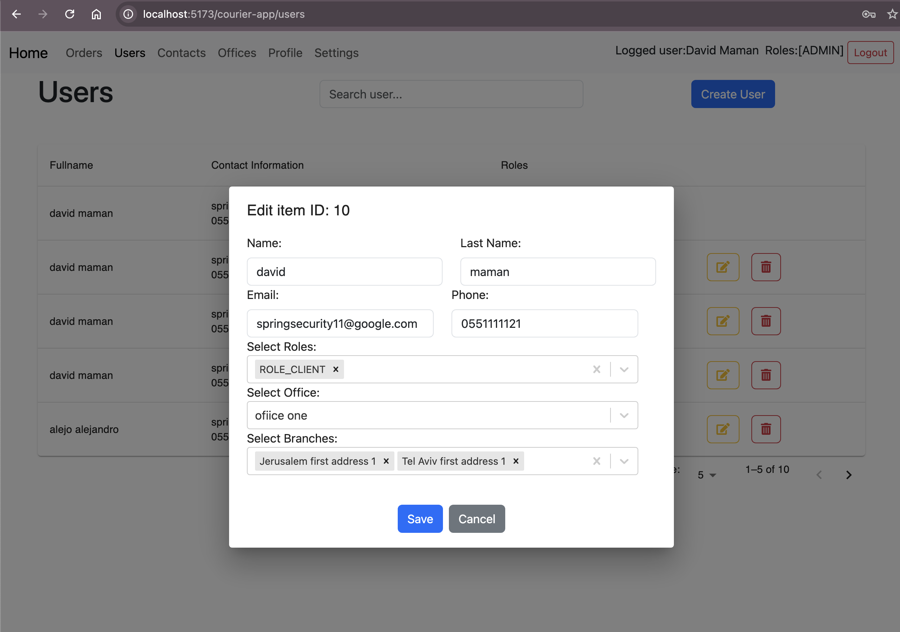
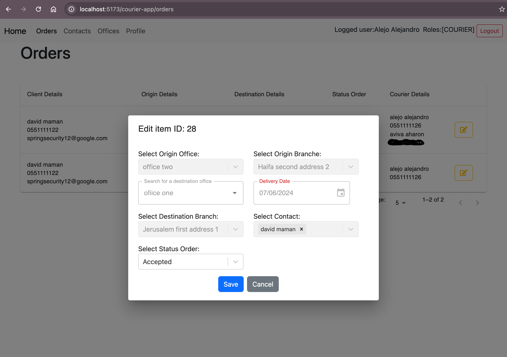
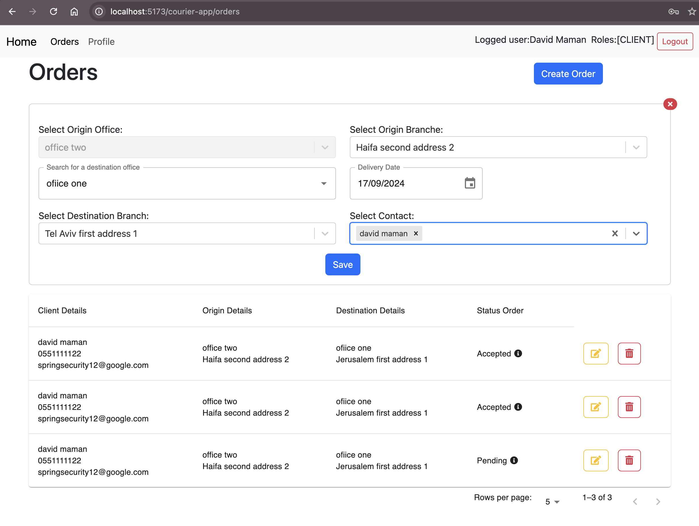

# Courier-App Frontend
In `Courier-App Frontend`, different users have varying levels of access depending on their assigned roles. This section outlines the specific actions each user can perform on various pages within the application. Defining clear permissions helps ensure the security and proper functioning of the system by restricting sensitive operations to authorized users only.

## Overview
The `Courier-App Frontend` is a web application built using **React** and **TypeScript**. It provides an interface for users to interact with the system, including managing contacts, offices, orders, and more. The application uses **Axios** to communicate with the backend and **Redux** for state management.

## Frontend Functionality

|  |  |
|:---:|:---:|
| *Login Page* | *Signup Page* |

### Admin Functionality
Admins have access to a wide range of features including user management, office and branch management, and order oversight.


*Admin Dashboard*

|  |  |
|:---:|:---:|
| *Admin Manage Users* | *Admin Create User* |

|  |  |
|:---:|:---:|
| *Admin Manage Branches* | *Admin Manage Orders* |

### Courier Functionality

Couriers can view and manage their assigned deliveries, update delivery statuses, and view order details.


*Courier Dashboard*

|  |  |
|:---:|:---:|
| *Courier Update Order* | *Courier Update Status Order* |

### Client Functionality

Clients can place orders, track the status of their deliveries, and update their profile information.


*Client Dashboard*

|  |  |
|:---:|:---:|
| *Client Create Order* | *Client Update Order* |

## Setup

### Prerequisites
- **Node.js** (Install using Homebrew: `brew install node`)
- **npm** or **yarn** (Comes with Node.js installation)

### Running the Application

1. **Clone the repository** and navigate to the `Courier-App` frontend directory.
    ```bash
    git clone https://github.com/dmaman86/courier-app.git
    cd courier-app/courier-frontend
    ```

2. **Setup and run:**
    ```bash
      npm install
      npm run dev
    ```

  This will start the application on `http://localhost:5173/courier-app/`.

# User Roles and Permissions
The **Courier-App Frontend** is designed to manage different types of users with specific permissions based on their roles. Below is a description of the actions allowed on each main page according to user roles: **ROLE_ADMIN**, **ROLE_COURIER**, and **ROLE_CLIENT**.

## 1. Home Page (not yet completed)
- **Admin**: 
- **Courier**:
- **Client**:

## 2. Contacts Page
- **Admin**: 
    - Create, update, and delete contacts.
    - View all contacts in the system.
- **Courier**: 
    - Can only view contacts assigned to their orders.
- **Client**: 
    - Can only view contacts when creating an order.

## 3. Offices Page
- **Admin**: 
    - Create, update, and delete offices.
    - View all offices in the system.
- **Courier**:
    - Can only view offices to which they are assigned.
- **Client**: 
    - Can only view offices when creating an order.

## 4. Orders Page
- **Admin**:
    - View all orders in the system.
    - Update and delete orders.
    - Assign orders to couriers.
- **Courier**:
    - View only orders assigned to them.
    - Update the status of orders (e.g., "on the way", "delivered").
- **Client**:
    - View their own orders.
    - Create new orders.
    - Update or cancel their orders before they are assigned to a courier.

## 5. Users Page
- **Admin**:
    - Create, update, and delete users.
    - Assign roles and permissions to users.
- **Courier** and **Client**: 
    - No access to this page.

## 6. Profile Page
- **Admin**, **Courier**, and **Client**:
    - All users can view and update their own profile.
    - Update personal data, change password.

## 7. SettingsAdmin Page
- **Admin**: 
    - Configure global system settings.
    - Manage permissions, notifications, and general configurations.

## 8. SignUp Page
- **Access**: 
    - Available to all unauthenticated users. Allows new clients to register. Users must be created by an admin.

### How Roles Are Implemented

- In the **frontend**, routes are protected using `ProtectedRoutes` to ensure that unauthenticated users or those without the correct permissions cannot access pages they are not authorized for.
- Additionally, **Redux** is used to manage the authentication state and user roles, ensuring that the interface is conditionally rendered based on the user’s role.

### Example Code Structur:
```jsx
// routes.ts
export const publicRoutes = (isLoading: boolean): RouteConfig[] => [
    {
        path: '/login',
        label: 'Login',
        element: <Login isLoading={isLoading}/>,
        allowedRoles: []
    },
    {
        path: '/signup',
        label: 'Sign Up',
        element: <SignUp isLoading={isLoading}/>,
        allowedRoles: []
    },
    {
        path: '*',
        label: '',
        element: <Navigate to="/login" replace />,
        allowedRoles: []
    }
]

export const privateRoutes = (isLoading: boolean, userDetails: User): RouteConfig[] => [
    {
        path: '/home',
        label: 'Home',
        element: <Home isLoading={isLoading} userDetails={userDetails}/>,
        allowedRoles: ['ROLE_ADMIN', 'ROLE_COURIER', 'ROLE_CLIENT']
    },
    {
        path: '/orders',
        label: 'Orders',
        element: <OrdersPage isLoading={isLoading} userDetails={userDetails}/>,
        allowedRoles: ['ROLE_ADMIN', 'ROLE_COURIER', 'ROLE_CLIENT']
    },
    {
        path: '/users',
        label: 'Users',
        element: <UsersPage isLoading={isLoading} userDetails={userDetails}/>,
        allowedRoles: ['ROLE_ADMIN']
    },
    {
        path: '/contacts',
        label: 'Contacts',
        element: <ContactsPage isLoading={isLoading} userDetails={userDetails}/>,
        allowedRoles: ['ROLE_ADMIN', 'ROLE_COURIER']
    },
    {
        path: '/offices',
        label: 'Offices',
        element: <OfficesPage isLoading={isLoading} userDetails={userDetails}/>,
        allowedRoles: ['ROLE_ADMIN', 'ROLE_COURIER']
    },
    {
        path: '/profile',
        label: 'Profile',
        element: <Profile isLoading={isLoading} userDetails={userDetails}/>,
        allowedRoles: ['ROLE_ADMIN', 'ROLE_COURIER', 'ROLE_CLIENT']
    },
    {
        path: '/settings',
        label: 'Settings',
        element: <SettingsAdmin isLoading={isLoading} userDetails={userDetails}/>,
        allowedRoles: ['ROLE_ADMIN']
    },
    {
        path: '*',
        label: '',
        element: <Navigate to="/home" replace />,
        allowedRoles: ['ROLE_ADMIN', 'ROLE_COURIER', 'ROLE_CLIENT']
    }
]

// ./src/useCases/useRouteConfig.ts
export const useRouteConfig = () => {

    const { userDetails, isLoading } = useAuth();
    const [ routes, setRoutes ] = useState<RouteConfig[]>([]);
    const [ links, setLinks ] = useState<{ path: string, label: string }[]>([]);

    const checkPermission = (allowedRoles: string[]): boolean => {
        if(!userDetails || !userDetails.roles.length) return false;
        const userRoles = userDetails.roles;

        return allowedRoles.length === 0 || userRoles.some(userRole => 
                                    allowedRoles.some(allowedRole => userRole.name === allowedRole));
    }

    const createRouteElement = (route: RouteConfig) => {
        return typeof route.element === 'function' ?
                React.createElement(route.element) :
                route.element;
    }

    const getRoutesPublic = () => {
        return publicRoutes(isLoading).map(route => ({
            ...route,
            element: createRouteElement(route)
        }));
    }

    const getRoutesPrivate = (userDetails: User) => {
        return privateRoutes(isLoading, userDetails).filter(route => checkPermission(route.allowedRoles))
                        .map(route => ({
                            ...route,
                            element: createRouteElement(route)
                        }));
    }

    const getPrivateLinks = (userDetails: User) => {
        return privateRoutes(isLoading, userDetails).filter(route => route.path !== '/home' && route.path !== '*' && checkPermission(route.allowedRoles))
                            .map(route => ({
                                path: route.path,
                                label: route.label
                            }));
    }

    useEffect(() => {
        const availableRoutes = userDetails ? getRoutesPrivate(userDetails) : getRoutesPublic();
        setRoutes(availableRoutes);

        const availableLinks = userDetails ? getPrivateLinks(userDetails) : [];
        setLinks(availableLinks);
    }, [userDetails]);

    return { 
        routes, 
        links
    };
}

// ProtectedRoutes.ts
export const ProtectedRoutes = () => {

    const { routes: allowedRoutes } = useRouteConfig();

    return (
        <Routes>
            {
                allowedRoutes.map((route, index) => (
                    <Route key={index} path={route.path} element={route.element} />
                ))
            } 
        </Routes>
    );


}
```

# Authentication and Token Handling
This section explains how authentication and token handling are implemented in the **Courier-App Frontend**.


## Authentication - `useAuth`

The `useAuth` hook manages user authentication and session persistence. It uses Redux for global state management and `localStorage` to persist user details between page reloads.

### Key Features:
- **Storing User Details**: When a user logs in, their details are saved in `localStorage` and Redux. Sensitive information, such as tokens, is not stored in `localStorage` but is handled via `httpOnly` cookies.
- **Restoring User Session**: If user details are found in `localStorage` but not in the Redux state, the user session is restored on page reload.
- **Logout**: The logout method clears the Redux state and `localStorage`, removing the user session.

### Code Example:
```tsx
// ./src/hooks/useAuth.ts
export const useAuth = () => {
    const dispatch: AppDispatch = useDispatch();
    const userDetails = useSelector(selectUserDetails);
    const isLoading = useSelector(selectIsLoading);

    useEffect(() => {
        const storedUserDetails = localStorage.getItem("userDetails");
        if (storedUserDetails && !userDetails) {
            dispatch(setUser(JSON.parse(storedUserDetails)));
        }
    }, [dispatch, userDetails]);

    const saveUser = (user: User | Client | null) => {
        dispatch(setUser(user));
        if (user) {
            localStorage.setItem("userDetails", JSON.stringify(user));
        } else {
            localStorage.removeItem("userDetails");
        }
    }

    const updateIsLoading = (loading: boolean) => {
        dispatch(setLoading(loading));
    }

    const logout = () => {
        dispatch(logoutAction());
        localStorage.removeItem("userDetails");
    }

    return { userDetails, saveUser, logout, updateIsLoading, isLoading };
}
```

## Token Management - `service`

Token management is handled via Axios interceptors. The application uses `httpOnly` cookies for storing access and refresh tokens. This ensures that tokens are not accessible via JavaScript, protecting them from XSS attacks.

### Key Features:
- **Refresh Token Flow**: If an API request returns a 401 status (unauthorized), a refresh token request is sent automatically. If successful, the original request is retried.

### Code Example:
```tsx
// ./src/services/api.ts
const status = (response: AxiosResponse): Promise<AxiosResponse> => {
    if(response.status >= 200 && response.status < 300){
        return Promise.resolve(response);
    }

    return Promise.reject(response);
}

export const service = (() => {

    const api: AxiosInstance = axios.create({
        baseURL: 'http://localhost:8080/api',
        headers: {
            'Content-Type': 'application/json',
        },
        withCredentials: true
    });
    
    const refreshAccessToken = async(): Promise<void> => {
        await api.post('/auth/refresh', {}, { withCredentials: true });
    }

    const onRequest = (config: InternalAxiosRequestConfig): InternalAxiosRequestConfig => {  
        return config;
    }

    const onRequestError = (error: any): Promise<any> => {
        return Promise.reject(error);
    }

    const onResponse = (response: AxiosResponse): Promise<AxiosResponse> => {
        return status(response);
    }

    const onResponseError = async(error: AxiosError): Promise<any> => {
        const originalRequest = error.config as ExtendedAxiosRequestConfig;

        if(!originalRequest) return Promise.reject(error);

        if(error.response?.status === 401){
            if(originalRequest.url === paths.auth.login){
                const apiError = error.response.data as ApiError;
                console.error('Error during login:', apiError);
                return Promise.reject(error);
            }

            if(!originalRequest._retry){
                originalRequest._retry = true;

                try{
                    await refreshAccessToken();

                    return api(originalRequest);
                }catch(refreshError){
                    console.error('Error during token refresh:', refreshError);
                    return Promise.reject(refreshError);
                }
            }
        }
        return Promise.reject(error);
    }

    api.interceptors.request.use(onRequest, onRequestError);
    api.interceptors.response.use(onResponse, onResponseError);

    return api;

})();
```

## Security Considerations:
- **httpOnly Cookies**: Tokens are stored in `httpOnly` cookies to prevent access via JavaScript, mitigating XSS attacks.

## Frontend Structure:

```bash
.
├── README.md
├── index.html
├── package-lock.json
├── package.json
├── public
│   └── vite.svg
├── src
│   ├── App.css
│   ├── App.tsx
│   ├── assets
│   │   └── react.svg
│   ├── domain
│   │   ├── axios.models.ts
│   │   ├── form.models.ts
│   │   ├── index.ts
│   │   ├── models.ts
│   │   ├── props.models.ts
│   │   └── reducer.models.ts
│   ├── helpers
│   │   ├── index.ts
│   │   ├── load-abort-axios.ts
│   │   ├── paths.ts
│   │   └── validation.form.ts
│   ├── hoc
│   │   ├── index.ts
│   │   └── withLoading.tsx
│   ├── hooks
│   │   ├── index.ts
│   │   ├── useAsync.ts
│   │   ├── useAuth.ts
│   │   ├── useDebounce.ts
│   │   ├── useFetchAndLoad.ts
│   │   ├── useForm.ts
│   │   └── useList.ts
│   ├── index.css
│   ├── main.tsx
│   ├── redux
│   │   ├── states
│   │   │   └── authSlice.ts
│   │   └── store.ts
│   ├── routes
│   │   ├── PrivateRoutes.tsx
│   │   ├── ProtectedRoutes.tsx
│   │   ├── PublicRoutes.tsx
│   │   ├── index.ts
│   │   └── routes.tsx
│   ├── services
│   │   ├── api.ts
│   │   ├── cache.ts
│   │   ├── index.ts
│   │   ├── service-request.ts
│   │   └── token.service.ts
│   ├── ui
│   │   ├── components
│   │   │   ├── content
│   │   │   │   ├── ItemsPage.tsx
│   │   │   │   └── index.ts
│   │   │   ├── dialogs
│   │   │   │   ├── CustomDialog.tsx
│   │   │   │   ├── GenericModal.tsx
│   │   │   │   └── index.ts
│   │   │   ├── entityForm
│   │   │   │   ├── BranchForm.tsx
│   │   │   │   ├── ContactForm.tsx
│   │   │   │   ├── OfficeForm.tsx
│   │   │   │   ├── OrderForm.tsx
│   │   │   │   ├── RoleForm.tsx
│   │   │   │   ├── StatusOrderForm.tsx
│   │   │   │   ├── UpdatePassword.tsx
│   │   │   │   ├── UserForm.tsx
│   │   │   │   └── index.ts
│   │   │   ├── form
│   │   │   │   ├── ReusableInput.tsx
│   │   │   │   ├── ReusableSelect.tsx
│   │   │   │   ├── SelectDetailsForm.tsx
│   │   │   │   └── index.ts
│   │   │   ├── index.ts
│   │   │   ├── layout
│   │   │   │   ├── BranchesPartial.tsx
│   │   │   │   ├── ErrorFallback.tsx
│   │   │   │   ├── Navbar.tsx
│   │   │   │   ├── NavbarLinks.tsx
│   │   │   │   ├── PageHeader.tsx
│   │   │   │   ├── PasswordRulesList.tsx
│   │   │   │   ├── RolePartial.tsx
│   │   │   │   ├── StatusOrdersPartial.tsx
│   │   │   │   ├── UserDetails.tsx
│   │   │   │   ├── index.ts
│   │   │   │   └── interface.ts
│   │   │   └── tables
│   │   │       ├── ReusableTable.tsx
│   │   │       └── index.ts
│   │   ├── index.ts
│   │   └── pages
│   │       ├── ContactsPage.tsx
│   │       ├── Home
│   │       │   ├── Home.tsx
│   │       │   ├── HomeAdmin.tsx
│   │       │   ├── HomeClient.tsx
│   │       │   └── HomeCourier.tsx
│   │       ├── Login.tsx
│   │       ├── OfficesPage.tsx
│   │       ├── OrdersPage.tsx
│   │       ├── Profile.tsx
│   │       ├── SettingsAdmin.tsx
│   │       ├── SignUp.tsx
│   │       ├── UsersPage.tsx
│   │       ├── index.ts
│   │       └── interface.ts
│   ├── useCases
│   │   ├── form
│   │   │   ├── index.ts
│   │   │   └── useAuthForm.ts
│   │   ├── index.ts
│   │   ├── useItemsPageState
│   │   │   ├── reducer.ts
│   │   │   └── useItemsPage.ts
│   │   ├── useNavbar
│   │   │   ├── reducer.ts
│   │   │   └── useNavbar.ts
│   │   ├── useRouteConfig.ts
│   │   └── useUserItemActions.ts
│   └── vite-env.d.ts
├── tsconfig.json
├── tsconfig.node.json
└── vite.config.ts
```
## Additional Frontend Information:

### Domain
- **Domain Definitions:** TypeScript models for Axios requests (`axios.models.ts`), form data (`form.models.ts`), general models (`models.ts`), and component props (`props.models.ts`) to ensure type safety across the application.

### Helpers and Hooks
- Custom hooks like `useAsync`, `useAuth`, `useFetchAndLoad`, `useForm`, and `useList` to manage data fetching, authentication, form handling, and other functionalities.
- Helper functions for various utilities and configurations like `load-abort-axios`, `paths`, and `validation.form`.

### Redux
- **State Management:** The `authSlice` and `store.ts` files configure Redux for global state management, handling authentication and other states.

### Routes
- **Routing Configuration:** `ProtectedRoutes` handle the routing logic for authenticated and unauthenticated users, respectively. The `routes.tsx` file defines the application's routes.

### Services
- **API Interaction:** Services like `api.ts`, `service-request.ts`, and `token.service.ts` manage interactions with the backend APIs, including token management and caching.

### UI
- ### Components:
    - **Content:** Contains components that manage and display data. The main example is ItemsPage.tsx, which centralizes the logic for display lists and data.
    - **Dialogs:** Modal components used to interact with entities, such as CustomDialog, GenericModal, and others, for creating or editing entities.
    - **EntityForm:** Specific forms for managing entities such as `BranchForm`, `ContactForm`, `OfficeForm`, `OrderForm`, `RoleForm`, `StatusOrderForm`, `UpdatePassword`, and `UserForm`. Each form is designed to handle a specific entity within the application.
    - **Form:** Contains reusable form components like `ReusableInput`, `ReusableSelect`, and `SelectDetailsForm`, which are used across various forms in the application.
    - **Layout:** Components that organize the structure and design of the application, such as `Navbar`, `NavbarLinks`, `PageHeader`, and partial components like `BranchesPartial`, `PasswordRulesList`, `RolePartial`, `StatusOrderPartial`, and `UserDetails`. These components are responsible for the visual and structural organization of the pages.
    - **Tables:** Components for managing and displaying reusable data tables, such as `ReusableTable.tsx`, which enables dynamic list management.

- ### Pages:
- Contains the main pages of the application that correspond to the defined routes. Some of these pages include:
    - **`ContactsPage.tsx:`** Manages contacts.
    - **`Home (and its variants HomeAdmin, HomeClient, HomeCourier):`** Landing pages for different user roles.
    - **`Login.tsx:`** Login page.
    - **`OfficesPage.tsx:`** Manages offices.
    - **`OrdersPage.tsx:`** Manages orders.
    - **`Profile.tsx:`** User profile page.
    - **`SettingsAdmin.tsx:`** Admin configuration page.
    - **`SignUp.tsx:`** Registration page.
    - **`UsersPage.tsx:`** Manages users.

- ### UseCases:
    - **`Form:`** Contains logic and hooks related to form handling.
        - **`useAuthForm.ts`** Manages the authentication form logic.
    - **`useItemsPageState`** Handles the state management for `ItemsPage`, including:
        - **`reducer.ts:`** Reducer logic for managing the page state.
        - **`useItemsPage.ts:`** Custom hook for managing `ItemsPage` logic.
    - **`useNavbar:`** Manages the state and logic for the application's navigation bar.
        - **`redurec.ts:`** Reducer logic for managing navigation state.
        - **`useNavbar.ts`** Custom hook for managing the navbar behavior.
    - **`useRouteConfig.ts:`** Custom hook that handles route configuration and guards.
    - **`useUserItemActions.ts:`** Handles actions related to user items, such as creation, updating, and deletion.